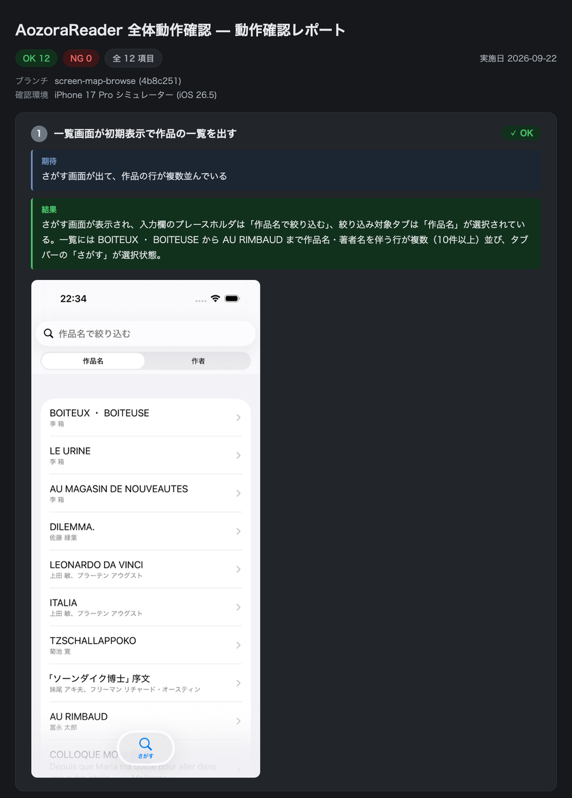

# claude-ios-e2e-skills

個人用に作った Claude Code の Skill とサブエージェントのまとめ。

iOSアプリの動作確認を、テストケースのレビューからシミュレーターでの証跡撮影、PR に貼るレポートまで通して任せられるようにしている。

## 構成

| 名前 | 種類 | 概要 |
| --- | --- | --- |
| `sim-test-report` | Skill | iOSシミュレーターでの動作確認を、テストケースのレビュー → 実施 → 証跡レポートまで通して進める。成果物は画像をbase64で埋め込んだ単一HTMLと、PRコメント貼り付け用の1枚PNG |
| `screen-map` | Skill | iOSアプリの画面マップを画面単位で作る。ソースを読んで画面ごとの要素と、操作するとどうなるか（遷移も結果の1つ）を特定し、`accessibilityIdentifier` を実装に振って `screen-map/screens/*.yaml` に落とす。マップを引く・確かめる `scripts/route.py`（check / screens / which / path）と、古い形からの移行 `scripts/migrate_map.py` もここにある。`sim-test-report` はこのマップから目的の画面までの経路を組み、動作確認のフローにする |
| `test-case-builder` | Agent | 確認項目を立て、画面マップがあれば実行できるフローまで組んで返す。コードの差分と画面マップを参照する。レビューを受けるのも実施も判定もしない。`sim-test-report` から呼ばれる |
| `sim-driver` | Agent | シミュレーターを操作して証跡スクリーンショットを撮る。判定はせず観測した事実だけ返す。`sim-test-report` から呼ばれる |
| `evidence-judge` | Agent | 証跡を読んでOK/NGを判定し、定義ファイルに書き込む。撮影もレポート生成もしない。`sim-test-report` から呼ばれる |
| `retaker` | Agent | 判定で撮り直しになった項目だけを、原因を見立てて直し、`run_flows.py --only` で撮り直す。判定はしない。`sim-test-report` から呼ばれる |

## セットアップ

clone したディレクトリで `./install.sh` を実行する。`~/.claude/` から `skills/*/` と `agents/*.md` へシンボリックリンクを張る。何度実行してもよく、リンク先に実体がある場合は動かさずに中断する。`--dry-run` を付けると何が起きるかだけ表示する。反映されるのはセッションを開き直したタイミング。

## 前提

- macOS — 証跡の撮影に `xcrun simctl`、画像の縮小に `sips` を使う
- iOSシミュレーターMCP（`mcp__Claude_Code_iOS_Simulator__control`）
- `python3` — レポート生成と、ビュー階層ダンプの抽出に使う。**Xcode 同梱の 3.9 で動く**ので、スクリプトに 3.10 以降の構文を持ち込まない
- Google Chrome — 1枚PNGの描画に使う。無い場合はHTMLのみ生成される
- Homebrew — `install.sh` が Maestro と openjdk を入れるのに使う。無い場合、`install.sh` はリンクを張ったあと失敗して止まる
- Maestro — ビュー階層のダンプとスクロールに使う。`install.sh` が mobile-dev-inc のタップから入れる（素の `brew install maestro` は別物が入るので注意）
- Java 17以上 — Maestro が使う。`install.sh` が openjdk も入れる。**Homebrew の openjdk は keg-only でシステムからは見えない**が、`maestrod.py` と `dump.sh` が `/usr/libexec/java_home` → `brew --prefix openjdk` の順で探して補うので、通常は手当て不要。どちらでも見つからない場所に JDK がある場合だけ `JAVA_HOME` を自分で設定する（未設定のままだと `Unable to locate a Java Runtime` で maestro が起動しない）

## 流れ

### 1. テストケースを立てる（LLM / `test-case-builder`）

ユーザーの指示から確認項目を立てる。コードの差分と、事前に用意した[画面マップ](skills/screen-map/reference/schema.md)を参照する。項目ごとに、どの画面で何を操作し、何が見えるはずかを **`plan.json` 1つ**に書く。そこまでの経路は書かない。以降のフローもマニフェストもここから作り、LLM が散文から写す箇所を残さない。

```json
{
  "app": "tx-tem.AozoraReaderClient",
  "items": [
    {"from": "browse",
     "title": "さがす画面の初期表示で作品一覧が出る",
     "expect": "絞り込み無しの一覧が出て、作品の行が複数並んでいる"},
    {"from": "browse",
     "title": "キーワード入力でデバウンス絞り込みが走る",
     "do": [{"op": "text:browse.search_field", "runtime": true}],
     "expect": "入力欄に出ている語を、一覧に残っている行がすべて作品名に含む"},
    {"from": "browse", "fresh": true,
     "title": "一覧の作品をタップすると詳細に移る",
     "do": ["tap:browse.book_row.*"],
     "expect": "詳細画面の作品名が、タップした行の作品名と一致する"},
    {"from": "book_detail", "when": ["ログイン中"],
     "title": "ログイン中に登録を押すと登録画面が開く",
     "do": ["tap:book_detail.register_button"],
     "expect": "…"}
  ],
  "explore": []
}
```

`do` はマップの要素を `tap:<id>` / `text:<id>` / `see:<id>`（見るだけの要素を見る）で、要素に紐づかない操作を `scroll:down` で指す。前提（`when`）はマップの `when` の文言をそのまま写し、条件つきの要素や、状態で結果が分かれる操作の枝を選ぶのに使う。

期待は値ではなく、証跡の中で確かめられる関係で書く。データに依る値は plan に焼き込まない。打つ文字は `do` に `"runtime": true` を添えて未定のまま残し、撮影時に画面を見て埋める。一覧の行のように同じ種類が並ぶ要素（ID の末尾が `*`）は、何も添えなければスクリプトが画面に見えている1件目を押し、条件があるときだけ `"pick": 条件` を添えて撮影時に選ぶ。

### 2. フローとテストの定義ファイルを作る（`manifest.py`）

plan から、Maestro のフローとテストの定義ファイル（`manifest.json`）を1本で作る。以降は定義ファイルだけで動く。

```bash
python3 ~/.claude/skills/sim-test-report/scripts/manifest.py \
  ~/.claude/skills/sim-test-report/.work/flows/<slug>/plan.json <出力先> \
  --repo <アプリのリポジトリ> --device iphone=<iPhoneのUDID> --device ipad=<iPadのUDID>
```

中で screen-map の経路計算（`scripts/screenmap/bridge.py`）を使う。plan の各項目について、前の項目が終わった画面から `from` までの経路を画面マップから計算し、`do` の操作と撮影を繋いで、項目ごとのフローとして書き出す。押す前・見る前には必ず見えるまでスクロールし（`scrollUntilVisible`）、画面に着いたら anchor → 読み込み完了の目印（`ready`）→ アニメーションの落ち着きの順に待つ。経路は同じ長さならタブバーを通る方を採る。

実行時に値を決める操作（打つ文字、どの行を押すか）があると、項目のフローはその手前で割れる。前の本は対象が見えるまでスクロールして止まり、次の本がその値を使う。

```yaml
# test_02.1.yaml — 検索欄が見えるまで運んで止まる
appId: tx-tem.AozoraReaderClient
---
- extendedWaitUntil:
    visible:
      id: '^browse$'
    timeout: 10000
- scrollUntilVisible:
    element:
      id: '^browse\.search_field$'
    direction: DOWN
    timeout: 60000
```

```yaml
# test_02.yaml — 決めた値で打って撮る
appId: tx-tem.AozoraReaderClient
env:
  SHOTS: ''
  BROWSE_SEARCH_FIELD: ''
---
- extendedWaitUntil:
    visible:
      id: '^browse$'
    timeout: 10000
- tapOn:
    id: '^browse\.search_field$'
- eraseText
- inputText: ${BROWSE_SEARCH_FIELD}
- extendedWaitUntil:
    visible:
      id: '^browse\.search_field$'
    timeout: 10000
- takeScreenshot: '${SHOTS}/test_02'
```

画面マップが無いアプリでは全項目が plan の `explore` になり、フローは書かない。マップはあっても経路が組めない項目（未マップの画面、座標が要る操作）は理由つきで返り、`explore` に移る。どちらも LLM（`sim-driver`）が画面を見ながら探索して撮る。

続けて、plan の項目と期待、書き出したフローの一覧を定義ファイルにまとめる。

```json
{
  "name": "test_02",
  "title": "キーワード入力でデバウンス絞り込みが走る",
  "from": "browse",
  "when": [],
  "screen": "browse",
  "expect": "入力欄に出ている語を、一覧に残っている行がすべて作品名に含む",
  "checked": "browse.search_field",
  "launch": false,
  "parts": [
    { "flow": "test_02.1.yaml", "decide": null },
    { "flow": "test_02.yaml", "decide": "BROWSE_SEARCH_FIELD" }
  ],
  "flow": "test_02.yaml",
  "picks": {},
  "input_use": { "BROWSE_SEARCH_FIELD": "text" },
  "devices": {
    "iphone": { "inputs": { "BROWSE_SEARCH_FIELD": "" }, "picked": {} },
    "ipad":   { "inputs": { "BROWSE_SEARCH_FIELD": "" }, "picked": {} }
  },
  "images": [
    { "src": "shots/iphone/test_02.png", "label": "iPhone" },
    { "src": "shots/ipad/test_02.png", "label": "iPad" }
  ],
  "desc": "",
  "result": "PENDING"
}
```

`inputs` は撮影する側（LLM）が画面を見て埋める値（`runtime` の打つ文字と、`pick` の選択）。条件の無い行の選択は `picks` に選び方だけがあり、撮影時にスクリプトが選んだ値が `picked` に入る。同じ名前の行が複数あると ID も同じになるので、スクリプトは押す直前の画面から何番目かを数え、Maestro の `index` で1件に絞って押す（`picked` の `_INDEX`）。

経路が組めなかった項目（plan の `explore`）も、フローを持たないセクションとして同じファイルに並べる。

このファイルを読み上げてレビューを受ける。直すところがあれば plan を直して手順2を叩き直し、合意してから撮影に入る。

### 3. フローを走らせる（`run_flows.py`）

フローを順に走らせ、証跡と同名のダンプを撮る。1回で全端末を、1台ずつ撮り切りながら回る。フローを持たない項目は LLM（`sim-driver`）が撮る。

```bash
python3 ~/.claude/skills/sim-test-report/scripts/run_flows.py \
  <出力先>/manifest.json
```

どのシミュレーターで撮るかは、手順2でマニフェストに記録してある。

割れたフローは順に走らせ、切れ目で値を決める。条件の無い行の選択は、その場で画面を読んで見えている1件目を選び、そのまま続ける（LLM は関与しない）。打つ文字と条件つきの選択は、その画面で止まって終わる。値を `inputs` に書いて同じコマンドを叩けば、止まった項目の止まった本から続きを走る。

判定で撮り直し（`RETAKE`）になった項目は、`--only test_07` でその項目だけ撮り直せる。同じ鎖の頭から手前の項目を撮らずになぞってから撮るので、ほかの項目の証跡と判定はそのまま残る。

### 4. 判定を書き込む（LLM / `evidence-judge`）

撮影したスクリーンショットとダンプを見て、結果を記録する。渡すのは定義ファイルのパスだけで、確認項目も期待も証跡もそこに入っている。

項目ごとに観測した事実（`desc`）と OK / NG（`result`）を書く。画像以外を根拠にしたときは、その項目の注記（`note`）に残す。期待のほうが狭かったと思えても期待は直さず NG のまま返し、期待を直すかはユーザーが選ぶ。

### 5. レポートを組む（`build_report.py`）

```bash
python3 ~/.claude/skills/sim-test-report/scripts/build_report.py <出力先>/manifest.json \
  --title "…"
```

渡すのは題だけ。確認環境は定義ファイルに記録した端末から、実施日は組んだ日からスクリプトが出す。ブランチは載せない（レポートは PR に貼るので、そちらで分かる）。

画像を base64 で埋め込んだ単一HTMLと、それを1枚に描画したPNGが出る。

項目ごとのカードには、レビューで合意した期待と、観測した結果が並び、その下に証跡が続く。レポートだけを見た人にも、何を期待して OK / NG にしたのかが読める。



スキルを経由せずここだけ使ってもよく、定義ファイルの形式は `build_report.py` 冒頭のdocstringを参照。

## テスト

スクリプト（screen-map の `route.py` / `migrate_map.py`、sim-test-report の `manifest.py` / `run_flows.py`）のテストは `tests/` にある。シミュレーターも Maestro も要らない。

```bash
python3 -m unittest discover tests
```

`tests/fixtures/app` の画面マップと plan から書かれるフローを、`tests/snapshots/` と比べる。フローの書き方を変えたときは `UPDATE_SNAPSHOTS=1` を付けて書き直し、差分を読んでから入れる。

スキル（LLM の振る舞い）の評価は `skills/*/evals/` にある。
