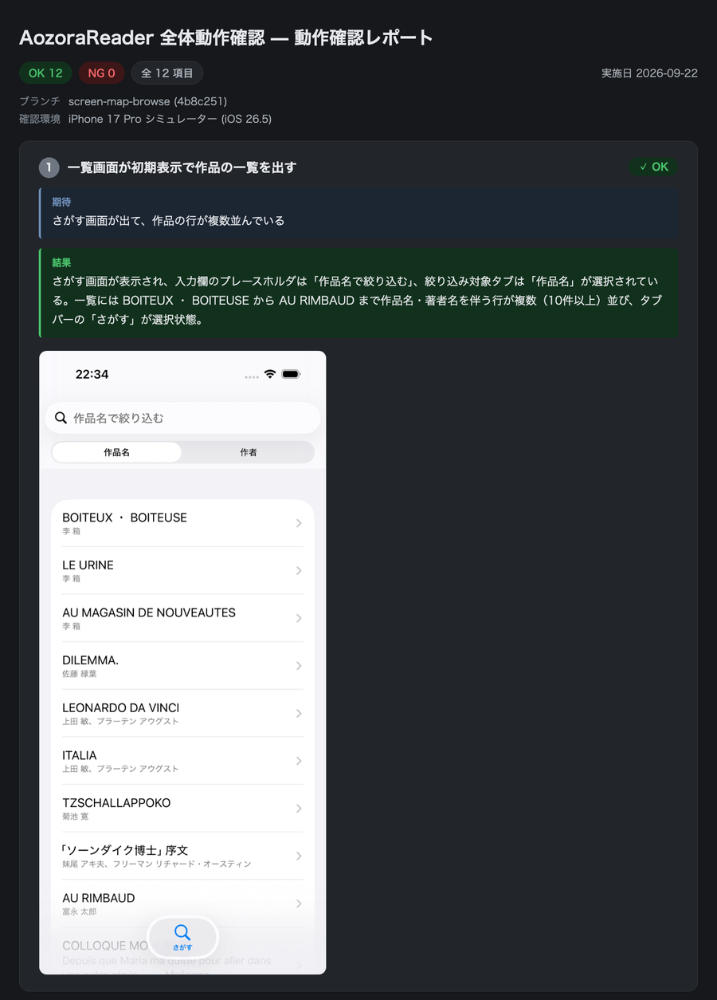

# claude-ios-e2e-skills

個人用に作った Claude Code の Skill とサブエージェントのまとめ。

iOSアプリの動作確認を、テストケースのレビューからシミュレーターでの証跡撮影、PR に貼るレポートまで通して任せられるようにしている。

## 構成

| 名前 | 種類 | 概要 |
| --- | --- | --- |
| `sim-test-report` | Skill | iOSシミュレーターでの動作確認を、テストケースのレビュー → 実施 → 証跡レポートまで通して進める。成果物は画像をbase64で埋め込んだ単一HTMLと、PRコメント貼り付け用の1枚PNG |
| `screen-map` | Skill | iOSアプリの画面マップを画面単位で作る。ソースを読んで画面ごとの要素と、操作するとどうなるか（遷移も結果の1つ）を特定し、`accessibilityIdentifier` を実装に振って `screen-map/screens/*.yaml` に落とす。マップを引く・確かめる `scripts/mapctl.py`（check / screens / which / path）と、古い形からの移行 `scripts/migrate_map.py` もここにある。`sim-test-report` はこのマップから目的の画面までの経路を組み、動作確認のフローにする |
| `test-case-builder` | Agent | コードの差分から確認項目を立て、画面マップがあれば実行できるフローまで組んで返す。レビューを受けるのも実施も判定もしない。`sim-test-report` から呼ばれる |
| `sim-driver` | Agent | シミュレーターを操作して証跡スクリーンショットを撮る。判定はせず観測した事実だけ返す。`sim-test-report` から呼ばれる |
| `evidence-judge` | Agent | 証跡を読んでOK/NGを判定し、定義ファイルに書き込む。撮影もレポート生成もしない。`sim-test-report` から呼ばれる |
| `retaker` | Agent | 判定で撮り直しになった項目だけを、原因を見立てて直し、`run_flows.py --only` で撮り直す。判定はしない。`sim-test-report` から呼ばれる |

## セットアップ

clone したディレクトリで `./install.sh` を実行する。`~/.claude/` から `skills/*/` と `agents/*.md` へシンボリックリンクを張る。何度実行してもよく、リンク先に実体がある場合は動かさずに中断する。`--dry-run` を付けると何が起きるかだけ表示する。反映されるのはセッションを開き直したタイミング。

## 前提

- macOS — 証跡の撮影に `xcrun simctl`、画像の縮小に `sips` を使う
- iOSシミュレーターMCP（`mcp__Claude_Code_iOS_Simulator__control`）
- `python3` — レポート生成と、ビュー階層ダンプの抽出に使う。**Xcode 同梱の 3.9 で動く**ので、スクリプトに 3.10 以降の構文を持ち込まない
- Google Chrome — 1枚PNGの描画に使う。無い場合はHTMLのみ生成される
- Homebrew — `install.sh` が Maestro と openjdk を入れるのに使う。無い場合、`install.sh` はリンクを張ったあと失敗して止まる
- Maestro — ビュー階層のダンプとスクロールに使う。`install.sh` が mobile-dev-inc のタップから入れる（素の `brew install maestro` は別物が入るので注意）
- Java 17以上 — Maestro が使う。`install.sh` が openjdk も入れる。**Homebrew の openjdk は keg-only でシステムからは見えない**が、`maestrod.py` と `dump.sh` が `/usr/libexec/java_home` → `brew --prefix openjdk` の順で探して補うので、通常は手当て不要。どちらでも見つからない場所に JDK がある場合だけ `JAVA_HOME` を自分で設定する（未設定のままだと `Unable to locate a Java Runtime` で maestro が起動しない）

## 流れ

実際に通しで動かしたときのやり取り（依頼 → テストケースのレビュー → plan → Maestro のフロー → 報告）は [docs/example-session.md](docs/example-session.md) にある。

### 1. テストケースを立てる（LLM / `test-case-builder`）

ユーザーの指示とコードの差分から確認項目を立てる。**差分があれば必ず読み、何を確かめるかは差分から決める。** 事前に用意した[画面マップ](skills/screen-map/reference/schema.md)は、立てた項目を撮れる形にするために引く（操作するアクセシビリティ ID、始める画面、そこまでの経路）。差分が無いとき（「一通り見て」など）は、マップで画面を探し、その画面のソースを読んで項目を立てる。

項目はテストケース（1つの機能を確かめるまとまり）にまとめ、項目ごとに、どの画面で何を操作し、何が見えるはずかを **`plan.json` 1つ**に書く。そこまでの経路は書かない。以降のフローもマニフェストもここから作り、LLM が散文から写す箇所を残さない。

```json
{
  "app": "com.example.app",
  "repo": "~/Program/<アプリのリポジトリ>",
  "cases": [
    {"title": "キーワードで一覧を絞り込める",
     "items": [
       {"from": "browse",
        "title": "キーワード入力でデバウンス絞り込みが走る",
        "do": [{"op": "text:browse.search_field", "runtime": true}],
        "expect": "入力欄に出ている語を、一覧に残っている行がすべて品名に含む"}]},
    {"title": "一覧から開いた詳細から戻ると、開いた行の位置に戻る",
     "items": [
       {"id": "open", "from": "browse",
        "title": "一覧の行をタップすると詳細に移る",
        "do": ["tap:browse.item_row.*"],
        "expect": "詳細画面の品名が、タップした行の品名と一致する"},
       {"from": "item_detail",
        "title": "詳細から戻ると一覧に戻る",
        "do": ["tap:BackButton"],
        "expect": "一覧に戻り、{open} でタップした行が見えている"}]},
    {"title": "ログイン中に登録を押すと登録画面が開く",
     "items": [
       {"from": "item_detail", "when": ["ログイン中"],
        "title": "ログイン中に登録を押すと登録画面が開く",
        "do": ["tap:item_detail.register_button"],
        "expect": "…"}]}
  ]
}
```

書き方（テストケースの分け方、`launch`、`do` の操作、データに依る値の決め方、期待の書き方）は [test-case-builder.md](agents/test-case-builder.md) と `manifest.py --help` にある。

### 2. フローとテストの定義ファイルを作る（`manifest.py`）

plan から、Maestro のフローとテストの定義ファイル（`manifest.json`）を1本で作る。以降は定義ファイルだけで動く。

```bash
python3 ~/.claude/skills/sim-test-report/scripts/manifest.py \
  ~/.claude/skills/sim-test-report/.work/flows/<slug>/plan.json <出力先> \
  --device iphone=<iPhoneのUDID> --device ipad=<iPadのUDID>
```

中で経路を計算する（`scripts/flowgen/bridge.py`。画面マップは screen-map の部品で読む）。plan の各項目について、前の項目が終わった画面から `from` までの経路を画面マップから計算し、`do` の操作と撮影を繋いで、項目ごとのフローとして書き出す。押す前・見る前には必ず見えるまでスクロールし（`scrollUntilVisible`。横スクロールの中の要素は、親を縦に寄せてからその親の上から送る）、画面に着いたら anchor → 読み込み完了の目印（`ready`）→ アニメーションの落ち着きの順に待つ。テストケースの境目では、画面マップの `leaves`（後に残る状態）に `reset`（既定に戻す操作）があればそれを叩き、無ければアプリを起動し直す。`launch` の付いたテストケースも起動し直してから始める。

どの語を打つか、どの行を押すかは、そのときの画面を見ないと決まらない。なのでフローに値を書き込まず、その操作の手前でフローを2本に分ける。1本目は対象が見えるところまで進んで止まり、そこで値を決めて、2本目がその値で操作して撮る。値を決めるのは次のどちらか。

- **条件の無い行の選択**（画面に見えている1件目）は、`run_flows.py` がその場で画面を読んで決め、止まらずに続ける
- **打つ語と、条件つきで選ぶ行**は、`run_flows.py` がそこで止まって LLM に返す。LLM が画面のダンプを見て値を決め、定義ファイルに書いて叩き直すと、2本目から続く

画面マップで経路が組めなかったテストケース（`explore`）はフローを作らない。LLM（`sim-driver`）が画面を見ながら操作して撮る。

定義ファイルには、項目ごとに題・期待・撮る画面・フロー・証跡の置き場と、判定の欄が並ぶ。形は `manifest.py` 冒頭の docstring を参照。

このファイルを読み上げてレビューを受ける。直すところがあれば plan を直して手順2を叩き直し、合意してから撮影に入る。

### 3. フローを走らせる（`run_flows.py`）

フローを順に走らせ、証跡と同名のダンプを撮る。1回で全端末を、1台ずつ撮り切りながら回る。フローを持たない項目は LLM（`sim-driver`）が撮る。

```bash
python3 ~/.claude/skills/sim-test-report/scripts/run_flows.py \
  <出力先>/manifest.json
```

LLM が値を決める操作で止まったら、値を書いて同じコマンドを叩けば続きを走る（手順2）。詳しくは `run_flows.py` 冒頭の docstring を参照。

### 4. 判定を書き込む（LLM / `evidence-judge`）

撮影したスクリーンショットとダンプを見て、結果を記録する。

項目ごとに観測した事実（`desc`）と OK / NG（`result`）を書く。画像以外を根拠にしたときは、その項目の注記（`note`）に残す。期待のほうが狭かったと思えても期待は直さず NG のまま返し、期待を直すかはユーザーが選ぶ。

### 5. レポートを組む（`build_report.py`）

```bash
python3 ~/.claude/skills/sim-test-report/scripts/build_report.py <出力先>/manifest.json \
  --title "…"
```

画像を base64 で埋め込んだ単一HTMLと、それを1枚に描画したPNGが出る。

項目ごとのカードには、レビューで合意した期待と、観測した結果が並び、その下に証跡が続く。レポートだけを見た人にも、何を期待して OK / NG にしたのかが読める。



スキルを経由せずここだけ使ってもよく、定義ファイルの形式は `build_report.py` 冒頭のdocstringを参照。

## テスト

スクリプト（screen-map の `mapctl.py` / `migrate_map.py`、sim-test-report の `manifest.py` / `run_flows.py`）のテストは `tests/` にある。

```bash
python3 -m unittest discover tests
```
