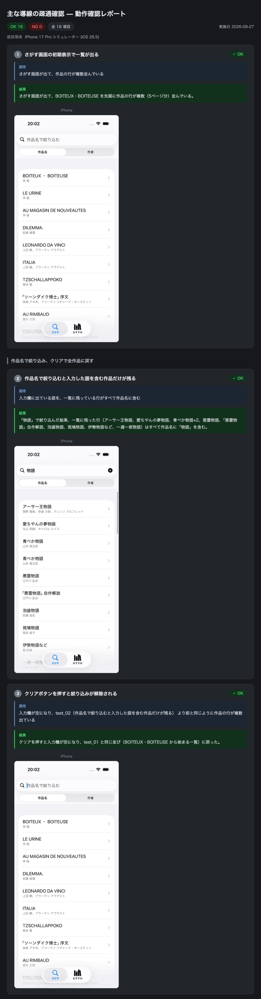

# 実際のやり取りの例

検証用のアプリ（青空文庫の作品を探して読む iOS アプリ。画面マップあり）で、`sim-test-report` を通しで動かしたときの記録。載せているのは、依頼・テストケースのレビュー（全文）・報告のやり取りと、plan と manifest の先頭の部分、3つの項目の Maestro のフロー、進捗ログの一部。

- 端末: iPhone 17 Pro（iOS 26.5）のシミュレーター
- 入口: 差分なし（アプリ全体の主な導線の疎通確認）
- 結果: 16項目すべて OK（エラー系の4項目はユーザーの判断で外した）

## 1. 依頼

> **ユーザー:** シミュレーターでテストして。テストケースは一般的なもので

メインのエージェントは `test-case-builder` を呼び、画面マップ（さがす・作品詳細・リーダー・おすすめの4画面）からテストケースを立てさせる。経路が組めることは `manifest.py` がこの時点で確かめる。

## 2. テストケースのレビュー

撮る前に、テストケースをユーザーに見せて合意をとる。以下はレビューに出したものの全文。テストケースの題が見出し、`［］` は撮る画面。`→ ここでアプリを起動し直す` は、後に状態（入力や絞り込み）を残すテストケースの後ろに入る。

> **Claude:** iPhone 17 Pro (iOS 26.5) で撮ります。差分はなしで、アプリ全体の主な導線を一通り確認します。
>
> **さがす画面の初期表示で一覧が出る**
>
> 1. さがす画面の初期表示で一覧が出る［さがす］
>    - 操作: なし（着いた状態を見る）
>    - 期待: さがす画面が出て、作品の行が複数並んでいる
>
> **作品名で絞り込み、クリアで全作品に戻す**
>
> 2. 作品名で絞り込むと、入力した語を含む作品だけが残る［さがす］
>    - 操作: 検索欄に入力する（打つ語は撮るときに決める）
>    - 期待: 一覧に残っている行はすべて、入力欄の語を作品名に含む
> 3. クリアボタンを押すと絞り込みが解除される［さがす］
>    - 操作: クリアボタンを押す
>    - 期待: 入力欄が空になり、test_02 より前と同じように作品の行が複数出ている
>
> **キーボードの検索キーで、すぐに絞り込みが確定する**
>
> 4. 検索キーを押すと、入力が止まるのを待たずに絞り込みが確定し、キーボードが閉じる［さがす］
>    - 操作: 検索欄に入力する（打つ語は撮るときに決める）→ 検索キーを押す
>    - 期待: 一覧に残っている行はすべて入力欄の語を含み、キーボードが閉じている
>    - ⚠ 画面の自動確認なし。証跡だけで判定
>
> → ここでアプリを起動し直す
>
> **作者セグメントに切り替えて絞り込む**
>
> 5. 作者セグメントに切り替えるとプレースホルダが変わる［さがす］
>    - 操作: 「作者」セグメントを押す
>    - 期待: 入力欄のプレースホルダが「作者で絞り込む」になっている
> 6. 作者名で絞り込むと、入力した語を含む作者の作品だけが残る［さがす］
>    - 操作: 検索欄に入力する（打つ語は撮るときに決める）
>    - 期待: 一覧に残っている行はすべて、作者に入力欄の語を含む
>
> → ここでアプリを起動し直す
>
> **一覧から開いた詳細から戻ると、開いた行の位置に戻る**
>
> 7. 一覧の行をタップすると詳細に移る［作品詳細］
>    - 操作: さがす画面で見えている1件目の行をタップする
>    - 期待: 詳細画面が開き、作品名がタップした行と一致する
> 8. 詳細から戻るとさがす画面に戻る［さがす］
>    - 操作: 戻るボタンを押す
>    - 期待: さがす画面が出て、test_07 でタップした行が一覧に見えている
>
> **さがすタブとおすすめタブを切り替えられる**
>
> 9. おすすめタブに切り替えるとおすすめ画面が出る［おすすめ］
>    - 操作: 「おすすめ」タブを押す
>    - 期待: おすすめ画面が出て、カテゴリーのカルーセルが複数並んでいる
> 10. さがすタブに戻ると一覧画面が出る［さがす］
>     - 操作: 「さがす」タブを押す
>     - 期待: さがす画面が出て、作品の行が並んでいる
>
> **おすすめのカルーセルから開いた詳細から戻ると、おすすめ画面に戻る**
>
> 11. カルーセルの作品をタップすると詳細に移る［作品詳細］
>     - 操作: おすすめ画面で見えている1件目の作品をタップする
>     - 期待: 詳細画面が開き、作品名がタップした作品と一致する
> 12. 詳細から戻るとおすすめ画面に戻る［おすすめ］
>     - 操作: 戻るボタンを押す
>     - 期待: おすすめ画面が出て、カテゴリーのカルーセルが並んでいる
>
> **図書カードを Safari で開く**
>
> 13. 図書カードを開くと、Safari で青空文庫の図書カードが開く［作品詳細］
>     - 操作: 詳細画面で図書カードのリンクを押す
>     - 期待: Safari に切り替わり、図書カードのページが開いている
>
> **本文を読み、戻ると詳細画面に戻る**
>
> 14. 「読む」を押すとリーダーで本文が開き、タブバーが隠れる［リーダー］
>     - 前提: 本文の HTML がある作品
>     - 操作: 詳細画面で「読む」ボタンを押す
>     - 期待: リーダー画面が開いて本文が表示され、タブバーが隠れている
> 15. 本文をスクロールすると読み進められる［リーダー］
>     - 操作: 下にスクロールする
>     - 期待: スクロール前と違う本文が表示され、戻るボタンは見えたまま
>     - ⚠ 画面の自動確認なし。証跡だけで判定
> 16. リーダーから戻ると詳細画面に戻り、タブバーが出る［作品詳細］
>     - 操作: 戻るボタンを押す
>     - 期待: 詳細画面が出て、タブバーが見えている
>
> **取得に失敗したときの再読み込み（17〜20）** ⚠ 一時コードが要る
>
> 17. 一覧の取得に失敗したあと、再読み込みで一覧が出る［さがす］— BrowseViewModel の取得を失敗させる
> 18. 詳細の取得に失敗したあと、再読み込みで詳細が出る［作品詳細］— DetailViewModel の取得を失敗させる
> 19. 本文の取得に失敗したあと、再読み込みで本文が出る［リーダー］— リーダーの本文の取得を失敗させる
> 20. おすすめの取得に失敗したあと、再読み込みでカルーセルが出る［おすすめ］— RecommendViewModel の取得を失敗させる
>
> 補足:
> - 14 は本文の HTML がある作品でないと「読む」ボタンが出ません。撮影のときに、ボタンが出る作品を選べるか確かめます。
> - マップの側で気づいた点が2つあります。「もっと見る」は行き先がまだ無いので、項目にしていません。一覧の続きの50件を読み込む動きも、今回は項目に入れていません。
>
> いくつか決めてください。

続けて、決めることを選択肢で聞く。

> **Claude:** エラー時の再読み込み（test_17〜20）はどうしますか？
> - 外す（推奨）: 1〜16だけ撮る。エラー系はレポートにスコープ外として残す
> - 仕込んで撮る: 各 ViewModel に失敗を注入する一時コードを入れて撮り、終わったら revert する
>
> **ユーザー:** 外す ／ このまま進める

## 3. plan.json（先頭のテストケース3つ）

レビューに出した内容の元。`test-case-builder` が書き、`manifest.py` がここからフローとマニフェストを作る。項目は経路を持たず、`from`（始める画面）と `do`（叩く操作）だけを書く。前の画面から `from` まではスクリプトが画面マップで繋ぐ。全9テストケース（エラー系を外したあと）のうち先頭の3つ。

```json
{
  "app": "tx-tem.AozoraReaderClient",
  "repo": "/Users/yoshiki-tx/Program/AozoraReader",
  "cases": [
    {
      "title": "さがす画面の初期表示で一覧が出る",
      "items": [
        {
          "from": "browse",
          "title": "さがす画面の初期表示で一覧が出る",
          "expect": "さがす画面が出て、作品の行が複数並んでいる"
        }
      ]
    },
    {
      "title": "作品名で絞り込み、クリアで全作品に戻す",
      "items": [
        {
          "id": "search1",
          "from": "browse",
          "do": [
            {
              "op": "text:browse.search_field",
              "runtime": true
            },
            {
              "op": "see:browse.book_row.*",
              "runtime": true
            }
          ],
          "title": "作品名で絞り込むと入力した語を含む作品だけが残る",
          "expect": "入力欄に出ている語を、一覧に残っている行がすべて作品名に含む"
        },
        {
          "from": "browse",
          "do": [
            "tap:Clear text"
          ],
          "title": "クリアボタンを押すと絞り込みが解除される",
          "expect": "入力欄が空になり、{search1} より前と同じように作品の行が複数出ている"
        }
      ]
    },
    {
      "title": "キーボードの検索キーで即座に絞り込みが確定する",
      "relaunch_after": true,
      "items": [
        {
          "from": "browse",
          "do": [
            {
              "op": "text:browse.search_field",
              "runtime": true
            },
            "tap:Search"
          ],
          "title": "検索キーを押すとデバウンスを待たずに絞り込みが確定し、キーボードが閉じる",
          "expect": "入力欄に出ている語を一覧に残っている行がすべて含み、キーボードが閉じている"
        }
      ]
    }
  ]
}
```

- **テストケース（`cases`）の中の項目は、前の項目の結果を当てにしてよい。** 期待の `{search1}` は同じテストケースの前の項目を指し、マニフェストでは `test_02（…）` に展開される
- **打つ語と、待つ行の語は `runtime`。** データに依る値は plan に書かず、撮影のときに画面を見て決める
- **`relaunch_after`** は、入力や絞り込みを後に残すテストケースに付ける。終わったらアプリを起動し直す

## 4. manifest.json（先頭の部分）

`manifest.py` が plan から作る定義ファイル。撮影（`run_flows.py`）、判定（`evidence-judge`）、レポート（`build_report.py`）はここだけを読む。下は判定まで終わったあとのもので、`cases` は先頭3つ、`sections` は先頭2つ。

```json
{
  "repo": "/Users/yoshiki-tx/Program/AozoraReader",
  "devices": {
    "iphone": {
      "udid": "0606D63A-C712-4026-B9E8-06A55AB4B7EF",
      "model": "iPhone 17 Pro",
      "os": "iOS 26.5"
    }
  },
  "flows": "/Users/yoshiki-tx/Program/claude-ios-e2e-skills/skills/sim-test-report/.work/flows/sim-test-report-general",
  "cases": [
    {
      "title": "さがす画面の初期表示で一覧が出る",
      "launch": false,
      "relaunch_after": false,
      "explore": null,
      "items": [
        "test_01"
      ]
    },
    {
      "title": "作品名で絞り込み、クリアで全作品に戻す",
      "launch": false,
      "relaunch_after": false,
      "explore": null,
      "items": [
        "test_02",
        "test_03"
      ]
    },
    {
      "title": "キーボードの検索キーで即座に絞り込みが確定する",
      "launch": false,
      "relaunch_after": true,
      "explore": null,
      "items": [
        "test_04"
      ]
    }
  ],
  "sections": [
    {
      "name": "test_01",
      "title": "さがす画面の初期表示で一覧が出る",
      "from": "browse",
      "case": "さがす画面の初期表示で一覧が出る",
      "do": [],
      "screen": "browse",
      "expect": "さがす画面が出て、作品の行が複数並んでいる",
      "checked": "browse",
      "launch": true,
      "when": [],
      "parts": [
        {
          "flow": "test_01.yaml",
          "decide": null
        }
      ],
      "flow": "test_01.yaml",
      "picks": {},
      "input_use": {},
      "devices": {
        "iphone": {
          "inputs": {},
          "picked": {}
        }
      },
      "images": [
        {
          "src": "shots/iphone/test_01.png",
          "label": "iPhone"
        }
      ],
      "desc": "さがす画面が出て、BOITEUX・BOITEUSE を先頭に作品の行が複数（5ページ分）並んでいる。",
      "note": "",
      "result": "OK"
    },
    {
      "name": "test_02",
      "title": "作品名で絞り込むと入力した語を含む作品だけが残る",
      "from": "browse",
      "case": "作品名で絞り込み、クリアで全作品に戻す",
      "do": [
        {
          "op": "text:browse.search_field",
          "runtime": true
        },
        {
          "op": "see:browse.book_row.*",
          "runtime": true
        }
      ],
      "screen": "browse",
      "expect": "入力欄に出ている語を、一覧に残っている行がすべて作品名に含む",
      "checked": "browse.book_row.*",
      "launch": false,
      "when": [],
      "parts": [
        {
          "flow": "test_02.1.yaml",
          "decide": null
        },
        {
          "flow": "test_02.2.yaml",
          "decide": "BROWSE_SEARCH_FIELD"
        },
        {
          "flow": "test_02.yaml",
          "decide": "BROWSE_BOOK_ROW"
        }
      ],
      "flow": "test_02.yaml",
      "picks": {},
      "input_use": {
        "BROWSE_SEARCH_FIELD": "text",
        "BROWSE_BOOK_ROW": "selector"
      },
      "devices": {
        "iphone": {
          "inputs": {
            "BROWSE_SEARCH_FIELD": "物語",
            "BROWSE_BOOK_ROW": "物語"
          },
          "picked": {}
        }
      },
      "images": [
        {
          "src": "shots/iphone/test_02.png",
          "label": "iPhone"
        }
      ],
      "desc": "「物語」で絞り込んだ結果、一覧に残った行（アーサー王物語、愛ちやんの夢物語、青べか物語×2、悪霊物語、「悪霊物語」自作解説、泡盛物語、斑鳩物語、伊勢物語など、一週一夜物語）はすべて作品名に「物語」を含む。",
      "note": "",
      "result": "OK"
    }
  ]
}
```

- **`parts`** は撮影時に値を決めるために割ったフロー。`decide` がその本の前に決める値
- **`devices.iphone.inputs`** は撮影時に決めた値（打った語「物語」と、待った行の語）
- **`desc` / `result`** は `evidence-judge` が証跡とダンプを読んで埋めたもの

## 5. Maestro のフロー（3つの項目）

`manifest.py` が plan から項目ごとに書く。撮影ごとに1本で、撮る地点でフローが切れる（証跡と同名のダンプをその場で取るため）。

### 撮影時に値を決める項目（test_02）

打つ語と、待つ行の語を撮影時に決めるので、フローはその手前で3本に割れる。

```yaml
# test_02.1.yaml — 検索欄が見えるところまで運んで止まる（ここで打つ語を決める）
- scrollUntilVisible:
    element:
      id: '^browse\.search_field$'
    direction: DOWN
    timeout: 60000
```

```yaml
# test_02.2.yaml — 決めた語を打って止まる（ここで待つ行の語を決める）
- tapOn:
    id: '^browse\.search_field$'
- eraseText
- inputText: ${BROWSE_SEARCH_FIELD}
```

```yaml
# test_02.yaml — その語を含む行が出るまで待って撮る
- scrollUntilVisible:
    element:
      id: '^browse\.book_row\..*${BROWSE_BOOK_ROW}.*'
    direction: DOWN
    centerElement: true
    timeout: 60000
    optional: true
- scrollUntilVisible:
    element:
      id: '^browse\.book_row\..*${BROWSE_BOOK_ROW}.*'
    direction: UP
    centerElement: true
    timeout: 60000
- takeScreenshot: '${SHOTS}/test_02'
```

止まるたびに、メインのエージェントが画面のダンプを見て値を書き、同じコマンドを叩き直すと続きから走る。今回は `BROWSE_SEARCH_FIELD` = `物語`、`BROWSE_BOOK_ROW` = `物語`。

### 戻る（test_08）

着いたことを画面の anchor と「読み込み完了の目印」で確かめてから撮る。

```yaml
# detail: tap BackButton — 前の画面に戻る → browse
- tapOn:
    id: '^BackButton$'
- extendedWaitUntil:
    visible:
      id: '^browse$'
    timeout: 10000
# browse: 読み込み完了（どれか1つ）
- extendedWaitUntil:
    visible:
      id: '(^browse\.book_row\..*|^browse\.error\.reload_button$)'
    timeout: 10000
- waitForAnimationToEnd:
    timeout: 3000
- takeScreenshot: '${SHOTS}/test_08'
```

### アプリの外に出る（test_13）

図書カードは詳細から始める1項目。詳細までの経路（ここでは直前のおすすめ画面からカルーセルの作品をタップ）はスクリプトが選ぶ。Safari に出たまま撮る。

```yaml
# recommend: tap recommend.book.* [見えている1件目] in recommend.carousel.*（見えている1件目） — 作品の詳細を開く → detail
- tapOn:
    id: '^${RECOMMEND_BOOK}$'
    childOf:
      id: '^${RECOMMEND_CAROUSEL}$'
    index: ${RECOMMEND_BOOK_INDEX}
# （中略）
# detail: tap detail.card_link — 青空文庫の図書カードを Safari で開く
- tapOn:
    id: '^detail\.card_link$'
# アプリの外（safari）に出る。確かめずに、外に居るまま撮る
- waitForAnimationToEnd:
    timeout: 3000
# detail: 「図書カード」が出るまで待つ
- extendedWaitUntil:
    visible:
      text: '.*図書カード.*'
    timeout: 10000
- takeScreenshot: '${SHOTS}/test_13'
```

## 6. 撮影と判定

撮影は `run_flows.py` を1回叩くだけ。進捗ログ（途中を省略）:

```
test_01 撮影済み
test_02 撮影せず 入力が未定（BROWSE_SEARCH_FIELD）
test_02 撮影済み
…
test_06 撮影できず フローが失敗
test_07 撮影済み（選んだ: BROWSE_BOOK_ROW=browse.book_row.BOITEUX ・ BOITEUSE）
…
test_16 撮影済み
```

test_06（作者名で絞り込む）は、待つ行の語に作者名「宮沢」を書いたために落ちた。一覧の行の ID は作品名で、作者名を含まない。絞り込み後に出ていた作品名「あけがた」に直し、`run_flows.py --only test_06` でこの項目だけ撮り直した（この取り違えは [#85](https://github.com/tx-TEM/claude-ios-e2e-skills/issues/85) で扱っている）。

撮り終えたら `evidence-judge` が証跡とダンプを読んで OK / NG を付け、`build_report.py` がレポートを組む。

## 7. 報告

> **Claude:** iPhone 17 Pro (iOS 26.5) で、アプリの主な導線を 16 項目確認しました。**16 件すべて OK** で、NG はありません。
>
> - **さがす画面:** 最初に一覧が出ること、作品名での絞り込み、クリアで元に戻ること、検索キーでキーボードが閉じること、作者に切り替えての絞り込みを確認しました。
> - **詳細画面:** 一覧からもおすすめからも、タップした作品の詳細が開き、戻ると元の画面に戻りました。
> - **タブ:** さがすとおすすめの行き来ができました。
> - **図書カード:** Safari で青空文庫の図書カードが開きました。
> - **リーダー:** 本文が開いてタブバーが隠れ、スクロールで先へ進み、戻ると詳細画面とタブバーに戻りました。
>
> レポートはデスクトップの `~/Desktop/sim-test-report-general/` にあります。HTML レポート、PR に貼る用の1枚画像、スクリーンショット一式が入っています。
>
> 補足が3つあります。
>
> - **確認していないこと:** 取得に失敗したときの再読み込み（一覧・詳細・本文・おすすめ）は、決めていただいたとおり外しました。おすすめの「もっと見る」は、行き先がまだ無いので外しました。一覧の続きの 50 件を読み込む動きも、今回は入れていません。いずれもレポートの footer に書いてあります。
> - **作者での絞り込み（test_06）は1回目の撮影で失敗し、撮り直しました。** アプリの不具合ではありません。一覧の行の ID が作品名だけでできていて作者名を含まないため、「宮沢」を含む行を待つ手順が一致しませんでした。待つ語を絞り込み後に出ていた作品名「あけがた」に変えて、この項目だけ撮り直しています。
> - （中略）
>
> 作ったデータはありません。

このとき届いたレポートの1枚画像（PR に貼る用）の先頭。全16項目のうち、最初の3項目まで:


